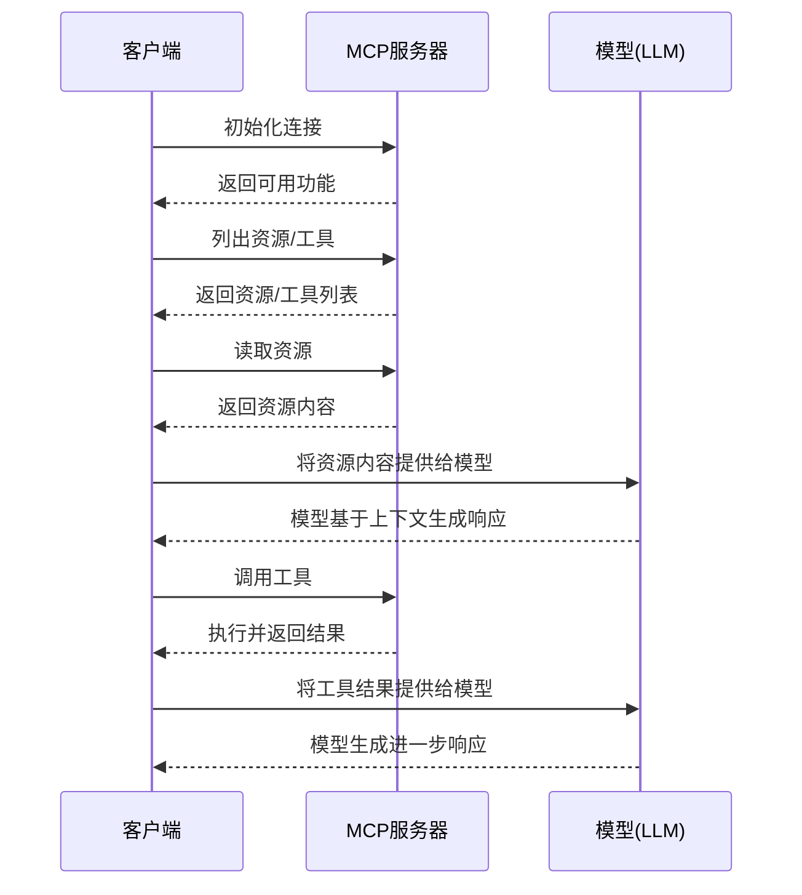

# 1.1 MCP简介

## MCP是什么及其解决的问题

**模型上下文协议(Model Context Protocol, MCP)** 是一种为大语言模型(LLM)提供上下文和工具的标准化协议。它的主要目标是解决以下核心问题：

1. **上下文分离**：将提供上下文的关注点与实际的LLM交互分离开来，使应用程序能够更灵活地管理模型上下文
2. **标准化交互**：为LLM应用提供统一的方式访问外部数据和功能
3. **工具集成**：简化大语言模型与外部工具和服务的集成
4. **开发效率**：减少开发人员在LLM应用中处理上下文和工具集成的重复工作

简单来说，MCP 就像是为大语言模型设计的一套"API标准"，它定义了如何向模型提供数据和功能，以及如何处理模型生成的响应。

## 核心概念

MCP 建立在三个核心原语之上：

### 1. 资源 (Resources)

**资源**是应用程序向模型提供的数据或信息。它们类似于RESTful API中的GET端点，主要用于将信息加载到模型的上下文中。

* 特点：
  * 以URI形式标识（如 `file://path/to/document` 或 `data://key/value`）
  * 不应执行重要的计算或产生副作用
  * 通常返回文本或结构化数据

* 示例：
  * 文件内容
  * 数据库查询结果
  * API响应
  * 用户配置信息

### 2. 工具 (Tools)

**工具**允许模型执行操作或调用外部功能。它们类似于RESTful API中的POST端点，预期会执行计算并可能产生副作用。

* 特点：
  * 具有名称、描述和参数定义
  * 可以执行各种操作，从简单计算到复杂的外部API调用
  * 返回操作结果或状态信息

* 示例：
  * 数学计算器
  * 天气查询API
  * 数据库写入操作
  * 邮件发送功能

### 3. 提示 (Prompts)

**提示**是可重用的模板，帮助LLM有效地与应用程序交互。它们可以包含指导、指令或上下文信息。

* 特点：
  * 预定义的对话模板
  * 可接受参数来自定义内容
  * 帮助模型理解如何处理特定任务

* 示例：
  * 代码审查提示模板
  * 客户服务回复指南
  * 数据分析框架
  * 内容创作指导

## MCP的工作原理和通信流程

MCP采用基于JSON-RPC的通信协议，允许客户端和服务器之间进行标准化交互。下面是一个典型的MCP通信流程：

通信过程主要包括以下阶段：

1. **初始化**：客户端连接到MCP服务器，获取服务器提供的功能和能力
2. **发现**：客户端获取可用的资源、工具和提示列表
3. **交互**：客户端读取资源、调用工具，并将结果提供给模型
4. **响应处理**：客户端处理模型的响应，可能涉及进一步的资源读取或工具调用

## 与传统API的对比

| 特性 | MCP | 传统API |
|------|-----|---------|
| 设计目标 | 专为大语言模型交互设计 | 通用数据和功能访问 |
| 上下文管理 | 内置的资源和上下文概念 | 需要自行管理上下文 |
| 交互模式 | 资源、工具和提示的统一接口 | 端点和方法的集合 |
| 元数据处理 | 丰富的描述和类型信息，便于模型理解 | 有限的元数据，主要面向开发者 |
| 自动发现 | 支持能力和功能的自动发现 | 通常需要文档或OpenAPI规范 |
| 集成便捷性 | 专为LLM集成优化 | 需要额外的适配层连接到LLM |

## 适用场景和限制

### 适用场景

1. **AI助手和聊天机器人**：提供丰富的上下文和工具集
2. **知识库和文档访问**：允许模型高效访问和处理大量文档
3. **数据分析和可视化**：通过工具支持复杂数据操作和可视化
4. **自动化工作流**：将LLM集成到现有业务流程和自动化任务中
5. **内容创作和编辑**：提供专业领域知识和编辑工具

### 限制

1. **协议开销**：相比直接API调用，可能增加一些通信和处理开销
2. **学习曲线**：需要理解MCP特有的概念和模式
3. **实现复杂性**：完整实现可能比简单API更复杂
4. **标准成熟度**：作为相对新的标准，可能随时间演变
5. **工具依赖**：合理使用工具需要模型有足够的能力理解工具文档

## 小结

本章详细介绍了MCP协议的基本概念、工作原理和适用场景。通过了解MCP的核心原语（资源、工具和提示），您可以更好地理解如何利用这一协议为大语言模型提供丰富的上下文和功能。

在接下来的章节中，我们将深入探讨如何设置MCP环境，并构建您的第一个MCP服务。

## 相关实现文件

- [mcp_中文.md](../../mcp_中文.md) - MCP协议中文详细说明
- [mcp/types.py](../../mcp/types.py) - MCP核心类型定义
- [mcp/__init__.py](../../mcp/__init__.py) - MCP库入口点 