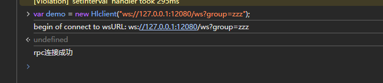
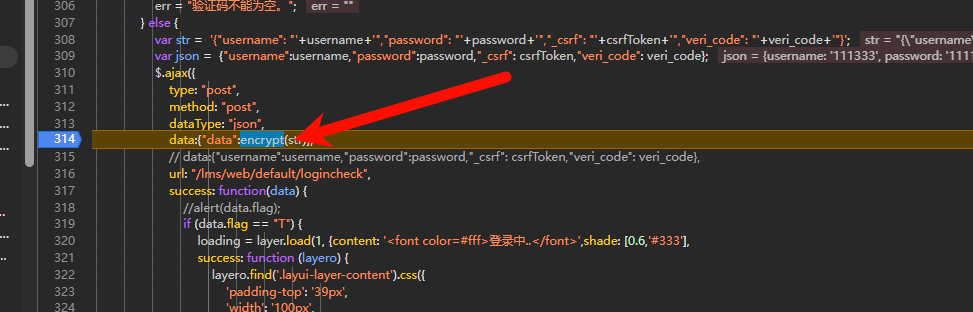
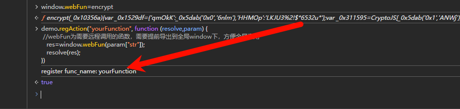

# jsRPC笔记


## 要注意的点

- 当浏览器显示：

> 浏览器显示 “Content unavailable. Resource was not cached”

### 原因和解决办法

> 一般是2和3，解决办法就是把F12的禁用缓存删了，并且按ctr+F5强制刷新，就可以了。或者去删除缓存数据再试一下。


1. **资源本身无法访问**
   
   要加载的资源（比如页面的脚本、图片、Jupyter 的前端组件）对应的 URL 失效了、服务器上该资源被删除，或服务端未正确提供该资源（比如之前卸载`runcell`时损坏了 Jupyter 的前端文件）。

2. **缓存策略限制**
   
   该资源的服务器响应头设置了 “禁止缓存”（如`Cache-Control: no-cache`），导致浏览器没把资源存在本地；后续再次加载时，又因为网络 / 服务端问题拿不到资源，就会提示。

3. **网络或请求被拦截**
   
   加载资源时网络中断、防火墙 / 浏览器扩展（如广告拦截器）拦截了请求，导致资源没成功加载，自然也没被缓存。

4. **应用（如 Jupyter）资源损坏**
   
   结合你之前操作过 Jupyter 的依赖安装 / 卸载，很可能是`runcell`的残留影响了 Jupyter 的前端资源文件，导致 Jupyter 页面加载时缺少必要资源。

#### 二、对应的解决办法

按以下步骤尝试，优先解决你（Jupyter 场景）的问题：

1. **刷新页面（最基础）**
   
   按`Ctrl+F5`强制刷新页面（跳过本地缓存，重新从服务器请求所有资源），看是否能正常加载。

2. **修复 Jupyter 的前端资源（针对你的场景）**
   
   如果是 Jupyter 页面出现这个提示，执行以下命令修复 Jupyter 的前端文件：
   
   bash
   
   运行
   
   ```bash
   # 卸载并重新安装Jupyter的前端组件
   pip uninstall jupyterlab notebook -y
   pip install jupyterlab notebook -y
   ```
   
   之后重启 Jupyter Notebook，再重新访问页面。

3. **清除浏览器缓存**
   
   浏览器缓存异常也可能导致该提示：
   
   - 按`Ctrl+Shift+Delete`打开 “清除浏览数据” 窗口；
   - 勾选 “缓存的图片和文件”，选择 “时间范围：全部时间”；
   - 点击 “清除数据”，然后重启浏览器再访问页面。

4. **检查网络与扩展**
   
   - 确认网络是否正常（比如打开其他网页是否能加载）；
   - 暂时关闭浏览器的广告拦截、隐私保护类扩展（比如 AdBlock、隐私獾），再重新加载页面。


- 遇到这种代码，可以去找一下反混淆js代码的网站能反混淆出来是什么加密。
  

```js
){var _0x532e0f=function(_0x1dc12f){while(--_0x1dc12f){_0x3a649e['push'](_0x3a649e['shift']());}};_0x532e0f(++_0x53a81d);}(__0xee999,0x1a9));var _0x5dab=function(_0x4c0979,_0x565e92){_0x4c0979=_0x4c0979-0x0;var 
```


## 执行流程


1. 打开服务端，也就是运行`window_amd64.exe`这个软件。软件下载地址：[Release v1.095 · jxhczhl/JsRpc · GitHub](https://github.com/jxhczhl/JsRpc/releases/tag/v1.095)

2. 在目标网站注入js代码（记住，这个是在没有断点的），注入的方式是：直接在控制台输入以下代码：

```js
var rpc_client_id, Hlclient = function (wsURL) {
    this.wsURL = wsURL;
    this.handlers = {
        _execjs: function (resolve, param) {
            var res = eval(param)
            if (!res) {
                resolve("没有返回值")
            } else {
                resolve(res)
            }
        }
    };
    this.socket = undefined;
    if (!wsURL) {
        throw new Error('wsURL can not be empty!!')
    }
    this.connect()
}
Hlclient.prototype.connect = function () {
    if (this.wsURL.indexOf("clientId=") === -1 && rpc_client_id) {
        this.wsURL += "&clientId=" + rpc_client_id
    }
    console.log('begin of connect to wsURL: ' + this.wsURL);
    var _this = this;
    try {
        this.socket = new WebSocket(this.wsURL);
        this.socket.onmessage = function (e) {
            _this.handlerRequest(e.data)
        }
    } catch (e) {
        console.log("connection failed,reconnect after 10s");
        setTimeout(function () {
            _this.connect()
        }, 10000)
    }
    this.socket.onclose = function () {
        console.log('rpc已关闭');
        setTimeout(function () {
            _this.connect()
        }, 10000)
    }
    this.socket.addEventListener('open', (event) => {
        console.log("rpc连接成功");
    });
    this.socket.addEventListener('error', (event) => {
        console.error('rpc连接出错,请检查是否打开服务端:', event.error);
    })
};
Hlclient.prototype.send = function (msg) {
    this.socket.send(msg)
}
Hlclient.prototype.regAction = function (func_name, func) {
    if (typeof func_name !== 'string') {
        throw new Error("an func_name must be string");
    }
    if (typeof func !== 'function') {
        throw new Error("must be function");
    }
    console.log("register func_name: " + func_name);
    this.handlers[func_name] = func;
    return true
}
Hlclient.prototype.handlerRequest = function (requestJson) {
    var _this = this;
    try {
        var result = JSON.parse(requestJson)
    } catch (error) {
        console.log("请求信息解析错误", requestJson);
        return
    }
    if (result["registerId"]) {
        rpc_client_id = result['registerId']
        return
    }
    if (!result['action'] || !result["message_id"]) {
        console.warn('没有方法或者消息id,不处理');
        return
    }
    var action = result["action"], message_id = result["message_id"]
    var theHandler = this.handlers[action];
    if (!theHandler) {
        this.sendResult(action, message_id, 'action没找到');
        return
    }
    try {
        if (!result["param"]) {
            const async_result = theHandler(function (response) {
                _this.sendResult(action, message_id, response);
            })
            if (async_result && typeof async_result.then === "function") {
                async_result.catch(e => {
                    _this.sendResult(action, message_id, "" + e);
                });
            }
            return
        }
        var param = result["param"]
        try {
            param = JSON.parse(param)
        } catch (e) {
        }
        theHandler(function (response) {
            _this.sendResult(action, message_id, response);
        }, param)
    } catch (e) {
        console.log("error: " + e);
        _this.sendResult(action, message_id, "" + e);
    }
}
Hlclient.prototype.sendResult = function (action, message_id, e) {
    if (typeof e === 'object' && e !== null) {
        try {
            e = JSON.stringify(e)
        } catch (v) {
            console.log(v)//不是json无需操作
        }
    }
    this.send(JSON.stringify({"action": action, "message_id": message_id, "response_data": e}));
}
```


3. 目标网站与JSRPC连接通信。写完之后会显示连接成功（这个也是断点之前的）。

```js
var demo = new Hlclient("ws://127.0.0.1:12080/ws?group=zzz");
```




> 可以先测试一下链接，在进行下一步

```js

import requests

js_code = """
(function(){
    console.log("test")
    return "执行成功"
})()
"""

url = "http://localhost:12080/execjs"
data = {
    "group": "zzz",
    "code": js_code
}
res = requests.post(url, data=data)
print(res.text)
```


4. 导出目标函数到window全局


断点定位到目标（encrypt）函数（定位到即将要执行这个函数这里就行），控制台执行：

`window.webFun=encrypt`




5. 注册函数

1、无参数取值

```js
demo.regAction("yourFunction", function (resolve) {
 //webFun为需要远程调用的函数，需要提前导出到全局window下，方便全局调用
 res=window.webFun();
   resolve(res);
})
```


2、一个参数

```js
demo.regAction("yourFunction", function (resolve,param) {
 //webFun为需要远程调用的函数，需要提前导出到全局window下，方便全局调用
 res=window.webFun(param);
   resolve(res);
})
```


3、多个参数（一般用这个）

```js
demo.regAction("yourFunction", function (resolve,param) {
 //webFun为需要远程调用的函数，需要提前导出到全局window下，方便全局调用
 // param1是参数的名称
   res=window.webFun(param["param1"],param["param2"]);
   resolve(res);
})

// 用这个并且是一个参数的情况
demo.regAction("yourFunction", function (resolve,param) {
 //webFun为需要远程调用的函数，需要提前导出到全局window下，方便全局调用
 // param1是参数的名称
   res=window.webFun(param["str"]);
   resolve(res);
})
```

注册完会返回一个true




### 六、远程调用取值

### 1、无参数调用

http://127.0.0.1:12080/go?group=zzz&action=yourFunction

### 2、一个参数调用

http://127.0.0.1:12080/go?group=zzz&action=yourFunction&param=123456

### 3、多个参数调用

```js
url = "http://127.0.0.1:12080/go"
data = {
   "group": "zzz",#分组
   "action": "yourFunction",#注册事件名称
   "param": json.dumps({"param1":"xxxx","param2":"yyyy"})#远程调用需要传递的参数
}
res=requests.post(url, data=data) 
print(res.text)
```


示例代码：

```python
import requests,json
url = "http://127.0.0.1:12080/go"
str = '{"username": "111333","password": "1111","_csrf": "L8kyluQJ62mqPt1cMGIFe-00_UH0ZoLL_8mz3lkrTBB5-3f-nkqlD8xSrj5JOmoItX62KqcS8IGnluGLKEkdVw==","veri_code": "1113"}'
data = {
 "group": "zzz",#分组
 "action": "yourFunction",#注册事件名称
 "param": json.dumps({"str":'{"username": "111333","password": "111","_csrf": "L8kyluQJ62mqPt1cMGIFe-00_UH0ZoLL_8mz3lkrTBB5-3f-nkqlD8xSrj5JOmoItX62KqcS8IGnluGLKEkdVw==","veri_code": "1113"}'})#远程调用需要传递的参数
}
res=requests.post(url, data=data) 
print(res.text)
```


