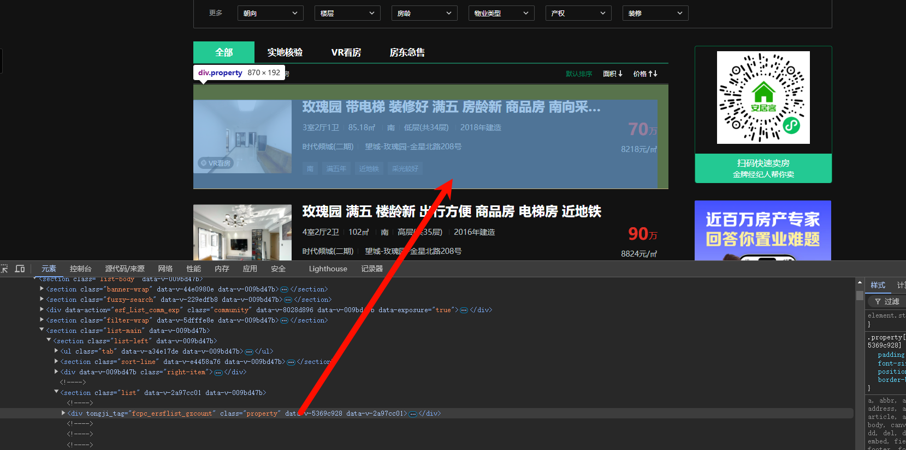
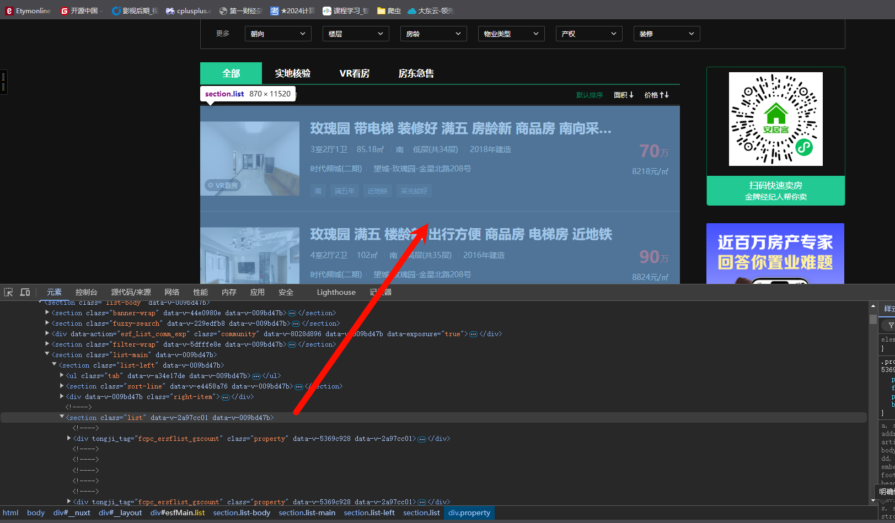

# 安居客-drissionpage

‍

## 翻页

翻页有俩种方式，一种是点击，一种是直接用导航栏翻页。

‍

‍

## 俩套获取元素值的办法

1. 定位到每一个元素，用eles匹配所有的元素，再一个一个处理。

    

    ```python
    # 获取所有的目标元素
    table_ele = dp.eles('.property', timeout=5)
    for item in table_ele:
    	.......

    ```

2. 定位到大元素，用`texts()`直接获取这个元素子元素的所有文本。

    

    ```python
    table_ele = dp.ele('.ant-table-tbody', timeout=5)
    # 获取当前页面数据
    result = table_ele.texts()
    ```

‍

## 基本流程

```python
# 实例化浏览器，应用配置
dp = ChromiumPage()
# 访问网址
base_url = f'https://cs.anjuke.com/sale/?q={location_encoded}'
dp.get(base_url)
# 滑动到底部
dp.scroll.to_bottom()
# 获取总页数
total_pages = int(dp.ele('.page').texts()[-1])
for i in range(1, total_pages+1):
    # 滑动到底部
    dp.scroll.to_bottom()
	# 获取所有的目标元素
    table_ele = dp.eles('.property', timeout=5)
    page_items = len(table_ele)
    total_items += page_items
    print(f"第{i}页，共{page_items}个房源")
    for item in table_ele:
	# 数据处理（交给AI就行了）

# pandas存储数据（这个也交给AI就行了）

```

‍

‍

## 完整代码

```python
'''Author: Python Crawler Developer crawler@example.com
Date: 2025-12-26 22:31:09
LastEditors: Python Crawler Developer crawler@example.com
LastEditTime: 2026-01-11 15:04:41
FilePath: \test\test.py
Description: 这是默认设置,请设置`customMade`, 打开koroFileHeader查看配置 进行设置: https://github.com/OBKoro1/koro1FileHeader/wiki/%E9%85%8D%E7%BD%AE
'''
from DrissionPage import ChromiumPage, ChromiumOptions
import pandas as pd

# 实例化浏览器，应用配置
dp = ChromiumPage()

# 初始URL - 第一页
base_url = 'https://cs.anjuke.com/sale/p1/?q=%E9%95%BF%E6%B2%99'
dp.get(base_url)
# 滑动到底部
dp.scroll.to_bottom()
# 获取总页数
total_pages = int(dp.ele('.page').texts()[-1])
print(f'总页数: {total_pages}')

# Create a list to store all property data
property_data = []

# Add counters to track items
total_items = 0
saved_items = 0

for i in range(1, total_pages+1):
    # 滑动到底部
    dp.scroll.to_bottom()
    table_ele = dp.eles('.property', timeout=5)
    page_items = len(table_ele)
    total_items += page_items
    print(f"第{i}页，共{page_items}个房源")
    
    for item in table_ele:
        data = item.text.split('\n')
        print(f"原始数据长度: {len(data)}, 内容: {data}")
        
        # 数据预处理：确保所有记录都有12个元素
        processed_data = data.copy()
        
        # 1. 如果没有VR看房标签，在开头插入空字符串
        if len(processed_data) > 0 and processed_data[0] != 'VR看房':
            processed_data.insert(0, '')
        
        # 2. 填充缺失的字段，确保数据长度为12
        while len(processed_data) < 12:
            processed_data.append('')
        
        # 3. 如果数据太长，截断到12个元素
        if len(processed_data) > 12:
            processed_data = processed_data[:12]
        
        print(f"处理后数据长度: {len(processed_data)}, 内容: {processed_data}")
        
        # Extract specific fields based on the data structure
        is_VR = 'VR看房' in processed_data[0]
        title = processed_data[1]
        layout = processed_data[2]
        area = processed_data[3].strip()
        orientation = processed_data[4]
        floor = processed_data[5].strip()
        year = processed_data[6].strip()
        community = processed_data[7]
        address = processed_data[8]
        features = processed_data[9]
        price = processed_data[10]
        price_per_sqm = processed_data[11].strip()
        
        # Print extracted fields
        print(f"VR看房: {is_VR}")
        print(f"标题: {title}")
        print(f"户型: {layout}")
        print(f"面积: {area}")
        print(f"朝向: {orientation}")
        print(f"楼层: {floor}")
        print(f"建造年份: {year}")
        print(f"小区: {community}")
        print(f"地址: {address}")
        print(f"特色: {features}")
        print(f"总价: {price}")
        print(f"单价: {price_per_sqm}")
        print("-" * 50)
        
        # Check if the record has landlord information
        has_landlord = '房东' in address or '*房东' in address
        
        # Store data in a dictionary
        property_dict = {
            'VR看房': is_VR,
            '标题': title,
            '户型': layout,
            '面积': area,
            '朝向': orientation,
            '楼层': floor,
            '建造年份': year,
            '小区': community,
            '地址': address,
            '特色': features,
            '总价': price,
            '单价': price_per_sqm,
            '有无房东': has_landlord
        }
        
        # Append to the list
        property_data.append(property_dict)
        saved_items += 1
    
    if i < total_pages:
        # 使用URL模式跳转到下一页 - 修改URL中的p参数
        print(f"\n正在跳转到第{i+1}页...")
        # 构造下一页URL，将p后面的数字替换为当前页+1
        next_page_url = f'https://cs.anjuke.com/sale/p{i+1}/?q=%E9%95%BF%E6%B2%99'
        print(f"正在访问: {next_page_url}")
        dp.get(next_page_url)
        # Wait for the page to load
        dp.wait(3)
        # Scroll to bottom of new page
        dp.scroll.to_bottom()
        # Wait for content to load
        dp.wait(2)

# Print summary of processing
print(f"\n处理汇总:")
print(f"总房源数: {total_items}")
print(f"保存房源数: {saved_items}")

# Convert list to pandas DataFrame
df = pd.DataFrame(property_data)

# Save to CSV file
csv_file = 'property_data.csv'
df.to_csv(csv_file, index=False, encoding='utf-8-sig')

print(f"\n数据已成功保存到 {csv_file}")
print(f"共保存了 {len(df)} 条房源数据")

# Display basic information about the data
print("\n数据基本信息:")
print(df.info())

# Display the first 5 rows
print("\n前5条数据:")
print(df.head())

```

‍
