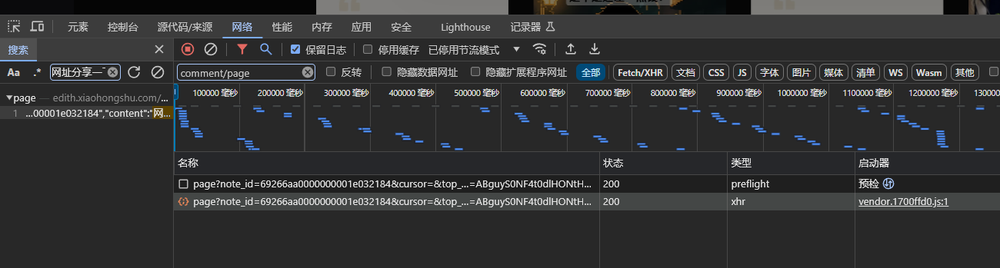
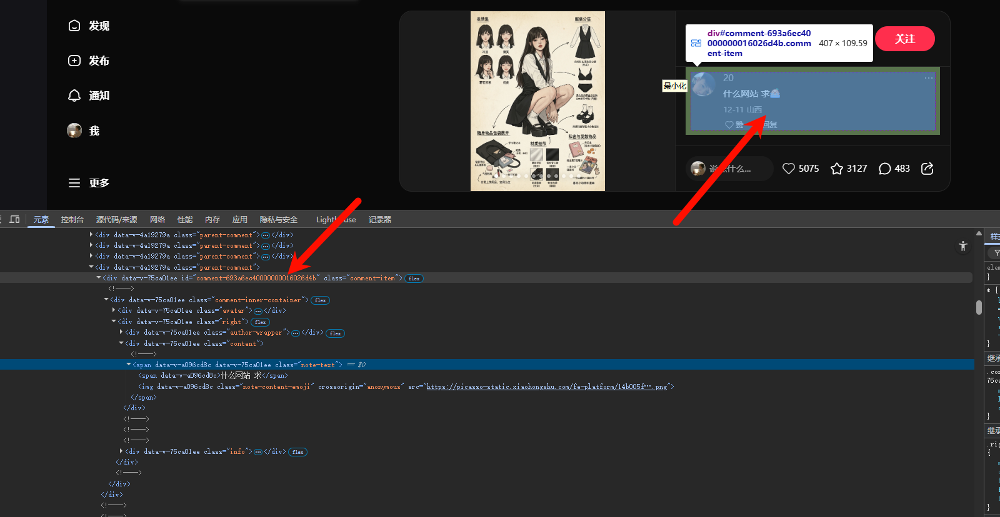

# drissionpage小红书评论爬取


## 需要注意的点


- 要关掉页面，不然不会重新发送数据包
- 为什么是监听`comment/page`因为，这个是这个包的特征元素，看下面那张图，通过这个搜索只能搜索到我们对应的数据包，如果是hi其他什么page之类的可能搜索的出俩个或者更多，这不是我们的特征元素。
- 一定要先监听再打开网页，先打开网页再监听是监听不到的。
- 


## 流程


1. 配置浏览器：
   ```python
   from DrissionPage import ChromiumOptions
   path = r'C:\\Program Files\\Google\\Chrome\\Application\\chrome.exe'
   ChromiumOptions().set_browser_path(path).save
   ```

2. 打开一个网址：

   ```python
   # 导入自动化模块
   from DrissionPage import ChromiumPage
   # 打开浏览器（实例化浏览器对象）
   dp = ChromiumPage()
   # 打开网址
   dp.get("https://www.xiaohongshu.com/explore/69266aa0000000001e032184?xsec_token=ABguyS0NF4t0dlHONtHZrXRgV5U3HsK0SuvZcAHlDD3Yw=&xsec_source=pc_feed")
   ```

3. 要关掉页面，不然不会重新发送数据包

4. 找我们我们需要的包，在点开评论之前打开F12，然后直接搜索评论的内容就能找到对应的数据包。

5. 监听数据包：

   为什么是监听`comment/page`因为，这个是这个包的特征元素，看下面那张图，通过这个搜索只能搜索到我们对应的数据包，如果是hi其他什么page之类的可能搜索的出俩个或者更多，这不是我们的特征元素。

   ```pythn
   # 监听数据包
   dp.listen.start('comment/page')
   ```

   

6. 解析数据直接用pandas就好了，高效。
   ```python
   
   df = pd.DataFrame(data)
       df.to_csv('xiaohongshu_comments.csv', index=False, encoding='utf-8-sig')
       print(f'第{page}页数据保存成功！')
   ```

7. 翻页处理的话，一定要想，翻页肯定不是固定的，而是要有一个锚点的，也就是翻页定位的数据跟我们的抓取的数据有关，有这个思路之后我们就找到了滑动和id是有关的（后面的就是person_id，在包里面叫id）。
   

   ```python
       # 定位标签
       _id = person_name
       table = dp.ele(f'#comment_{_id}')
       # 下滑页面
       dp.scroll.to_see(table)
   ```

8. 可以先获取一下评论的数量，再进行翻多少页合适。


总代码：

```python

'''
Author: Python Crawler Developer crawler@example.com
Date: 2025-12-16 17:50:40
LastEditors: Python Crawler Developer crawler@example.com
LastEditTime: 2025-12-25 00:23:29
FilePath: \test\test.py
Description: 这是默认设置,请设置`customMade`, 打开koroFileHeader查看配置 进行设置: https://github.com/OBKoro1/koro1FileHeader/wiki/%E9%85%8D%E7%BD%AE
'''
# 导入自动化模块
from DrissionPage import ChromiumPage
import datetime
import pandas as pd
# 打开浏览器（实例化浏览器对象）
dp = ChromiumPage()
# 先启动监听数据包
dp.listen.start('comment/page')
# 再打开网址（触发网络请求）
dp.get("https://www.xiaohongshu.com/explore/69266aa0000000001e032184?xsec_token=ABguyS0NF4t0dlHONtHZrXRgV5U3HsK0SuvZcAHlDD3Yw=&xsec_source=pc_feed")
# 等待数据包加载
r = dp.listen.wait()
# print(r.response.status_code)
# 获取数据包内容
json_data = r.response.body
# 打印数据包内容
# print(json_data)

# 获取评论的数量
comment_count = dp.ele('xpath:.//span[@class="chat-wrapper"]/span[@class="count"]').text
print(f"评论数量: {comment_count}")

# 初始化数据列表（在所有循环外，避免被清空）
data = []

# 翻页采集（限制最多采集20页，避免无限循环）
max_pages = int(comment_count)
for page in range(1, max_pages + 1):
    print(f"正在采集第{page}页数据...")
    
    # 解析当前页的所有评论
    for items in json_data['data']['comments']:
        id = items['id']
        note_id = items['note_id']
        location = items['ip_location']
        # 将毫秒级时间戳转换为可读时间格式
        timestamp_ms = items['create_time']
        timestamp_s = timestamp_ms / 1000  # 转换为秒
        time = datetime.datetime.fromtimestamp(timestamp_s).strftime('%Y-%m-%d %H:%M:%S')
        content = items['content']
        
        # 将数据添加到列表（所有评论都保存在同一个列表中）
        data.append({
            'id': id,
            'note_id': note_id,
            'location': location,
            'time': time,
            'content': content
        })

    print(f'第{page}页解析完成，累计采集 {len(data)} 条评论')
    
    # 定位最后一条评论的标签并下滑页面
    if data:  # 确保有数据
        _id = data[-1]['id']  # 使用最后一条评论的id
        try:
            table = dp.ele(f'#comment-{_id}')
            # 下滑页面到该元素
            dp.scroll.to_see(table)
            
            # 等待新的数据包加载
            try:
                print("等待新数据包...")
                r = dp.listen.wait(timeout=5)
                json_data = r.response.body  # 更新为新的数据包
            except Exception as e:
                print(f"获取第{page+1}页数据超时: {e}")
                break
        except Exception as e:
            print(f"定位元素或滚动失败: {e}")
            break

# 所有页面采集完成后，一次性保存到CSV文件
if data:
    df = pd.DataFrame(data)
    df.to_csv('xiaohongshu_comments.csv', index=False, encoding='utf-8-sig')
    print(f'所有数据保存成功！共采集 {len(data)} 条评论')
else:
    print("未采集到任何数据")


# 关闭浏览器
# dp.close()


# from DrissionPage import ChromiumOptions
# path = r'C:\\Program Files\\Google\\Chrome\\Application\\chrome.exe'
# ChromiumOptions().set_browser_path(path).save
```

