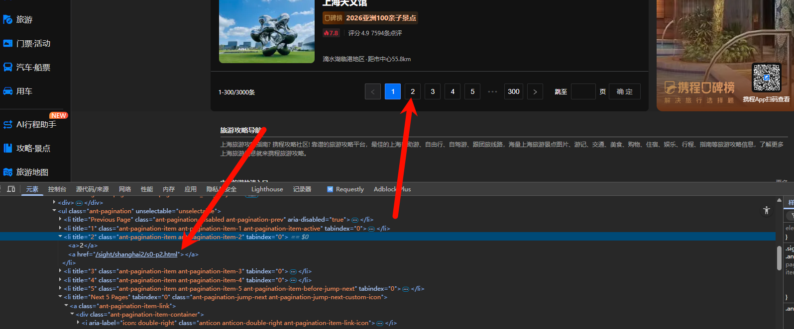
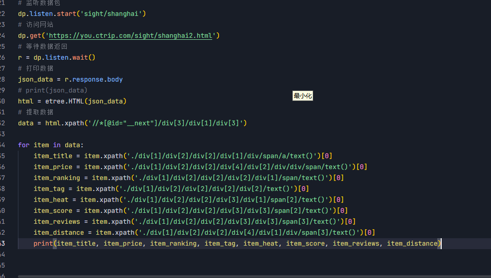
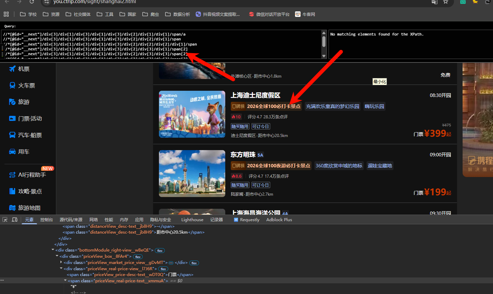

# drissionpage爬取携程景点数据


目标网址：https://you.ctrip.com/sight/shanghai2.html


## 注意的点


- 我觉得这个项目不要用dp，有没有什么加密参数，直接用request不就行了（后面做了一下发现，还是徐需要的，只是第一页不需要而已）。
- 用xml搞不定，就用re，re是一定能搞定的，就是效率和难度比较大而已


我直接点击下一页，他的地址没有变化，但是刷新了，说明他肯定是有心的网址，于是我点击下面页码的元素，果然。

注意：如果以后渲染段没有变化的话，我们直接去找这个元素的href属性就好了，他跳转了一定是跳转到href属性了。




 没点击到元素就把范围缩小一点看看，小一点不行就大邑县，反正多试几次就好了。

```python
# 点击下一页
dp.ele('.anticon anticon-right').click(by_js=True)
```


- 在处理数据之前一定要检查一下数据的类型，不然容易出错

```python
            data = []
            if isinstance(json_data, dict):
                if 'attractionList' in json_data:
                    for item in json_data['attractionList']:
```


- 提取字段的时候用get方法比较好，不容易出错，还可以滞空

```python

                        # 提取需要的字段，使用get()方法避免键不存在的错误
                        card = item.get('card', {})
                        poiName = card.get('poiName', '')
                        price = card.get('price', '')
                        distanceStr = card.get('distanceStr', '')
                        zoneName = card.get('zoneName', '')
                        coverImageUrl = card.get('coverImageUrl', '')
                        dynamicCoverImageUrl = card.get('dynamicCoverImageUrl', '')
                        detailUrl = card.get('detailUrl', '')
                        tagNameList = card.get('tagNameList', [])
                        otherTagList = card.get('otherTagList', []) 
```


### xpath


如果直接使用网页源代码里面那个绝对的xpath的话不一定能解析出来（因为网页上的代码是已经渲染好的，和我们获取的文件是不一样的）。




### re


用re必须要是字符串，有事收返回的是字节流，记得转成字符串格式的。


可以向我这样，先把每一个的xpath写到上面，就知道哪一个在前，哪一个在后，就好些re的预加载函数（也叫模板函数）了。




==因为我要匹配的太多，效率太低了，没有匹配成功，，如果是少量的可以用这个，但是大量的还是算了吧。==


```python
obj = re.compile(r'<a href="https://you.ctrip.com/sight/shanghai2/1412255.html\?scene=online" class="">(.*?)</a>.*?<span class="rankInfoModule_rank_desc_text__QY4cm ">(.*?)</span>.*?<span class="rankInfoModule_tag_text__FCSHe">(.*?)</span>.*?<span class="rankInfoModule_tag_text__FCSHe">(.*?)</span>.*?<span class="commentInfoModule_heat-score_value__J8p3b">(.*?)</span>.*?<span class="commentInfoModule_comment-text__UBk1F commentInfoModule_comment-score_value__iUsa8">(.*?)</span>.*?<span class="commentInfoModule_comment-text__UBk1F">(.*?)</span>.*?<span class="distanceView_desc-text__jb8H9">(.*?)</span>.*?<span class="distanceView_desc-text__jb8H9">(.*?)</span>.*?<span class="priceView_real-price-text__xmmuA">(.*?)/span>')
result = obj.finditer(html_data)
for item in result:
    print(item.group(1), item.group(2), item.group(3), item.group(4), item.group(5), item.group(6), item.group(7), item.group(8), item.group(9))


```


==运行效率高的话，还是用findall吧，但是findall他不能匹配，也就是说后面组合的时候可能牛头不对马嘴，就比如说：这里面有一些人有标签，有一些没有，那后面匹配的时候就不好匹配，要么再加上一个字段（Id或者唯一标识符字段，比如在前面加上1_），进行匹配是最好的。==


### bueatifulsoup


### dp自带的语法


