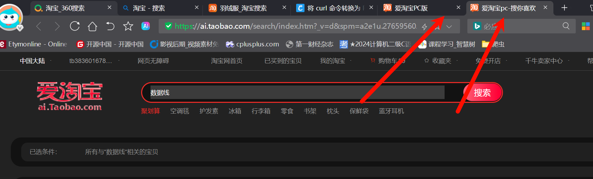
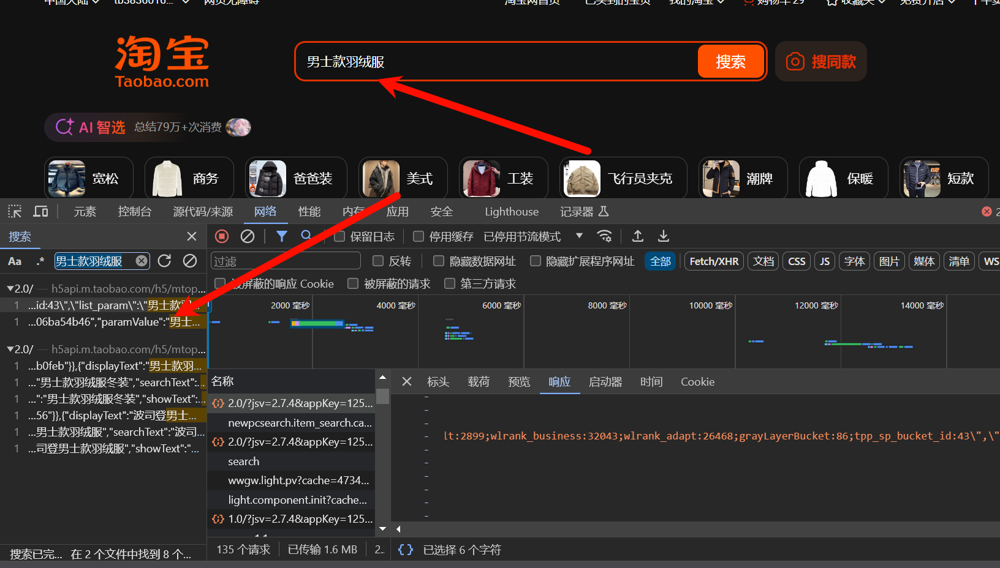

# 淘宝数据抓取

# 要注意的点

- 我直接把请求复制到`Hoppscotch`发现没有`cookie`，复制到`postman`有没有一键导入功能，我之后学习一下API的这种 可视化工具吧。
- 

## 找接口

目标网址：https://s.taobao.com/search?commend=all&ie=utf8&initiative_id=tbindexz_20170306&page=1&preLoadOrigin=https%3A%2F%2Fwww.taobao.com&q=%E7%BE%BD%E7%BB%92%E6%9C%8D&search_type=item&sourceId=tb.index&spm=a21bo.jianhua%2Fa.search_manual.0&ssid=s5-e&tab=all

直接搜索商品，他会跳转到指定的链接。

直接搜索商品的名字，就能找到对应的包不过这个好像是假的淘宝，后面是真淘宝放心。

所以得到目标的接口是：https://h5api.m.taobao.com/h5/mtop.relationrecommend.wirelessrecommend.recommend/2.0/?jsv=2.7.4&appKey=12574478&t=1765338514487&sign=

后面还有很长，我这里缩短了。

## 代码实现

- 老样子，复制bash格式，记得要先找到对应的包，直接搜索就能找到对应的包。

### 发送请求

### 获取数据

### 解析数据

### 保存数据

1. - 

