# 爬取历史天气数据

‍

目标网址：[https://lishi.tianqi.com/shanghai/202403.html](https://lishi.tianqi.com/shanghai/202403.html)

‍

## 注意的点

‍

### 搜索技巧

1. 直接搜索我们要逆行的参数名字
2. 搜索常见的加密形式，encrypt，decrypt
3. hook一下，请求头加密就hook请求头，有cookie加密就hookcookie，有数据加密就hook，json.parse，并且json.parse是必须要进行到第二次的，因为第一次是加载加密数据的，第二次才是加载解密数据的
4. 搜索常见的算法AES，RSA，MD5，。。。

‍

‍

### 长代码怎么处理？

1. 一般看到长代码，要先每一个都收缩起来，然后看整体。
2. 我运行了几下，发点都是定义，很快就到结尾了
3. 看函数主要看三部分：函数的参数，函数的返回值，函数的过程

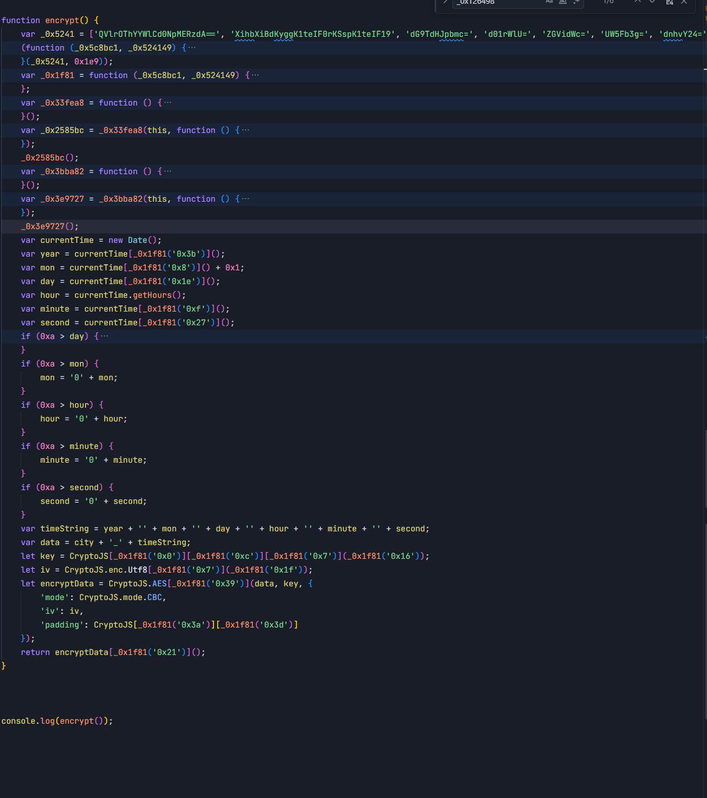

‍

运行的时候可以直接用调到下一个函数调用，不要用一步一步调用（太细了），因为我看了整体的代码，说明他很快就会运行到我们需要的位置

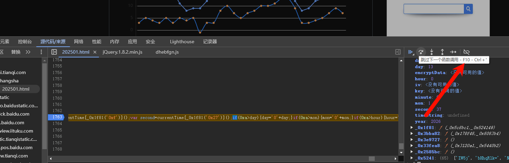

‍

‍

### 字节流

看到这种字节流，直接用一个函数在控制台打印就行。

打印的方法：

```js
CryptoJS.enc.Hex.stringify(CryptoJS[_0x1f81('0x0')][_0x1f81('0xc')][_0x1f81('0x7')](_0x1f81('0x16')))
// CryptoJS.enc.Hex.stringify 是这个方法在起作用
```

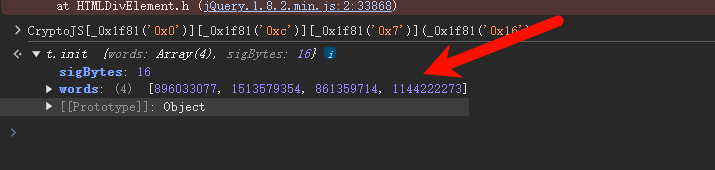

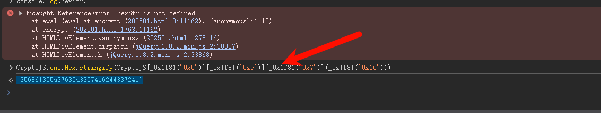

```js

{
    "words": [
        896033077,
        1513579354,
        861359714,
        1144222273
    ],
    "sigBytes": 16
}
```

‍

‍

‍

## 混淆技巧

可以去找反混淆网站去反混淆一下，也可以不混淆，直接猜，这些里都是方法，我们只要找到对应数值就行了。

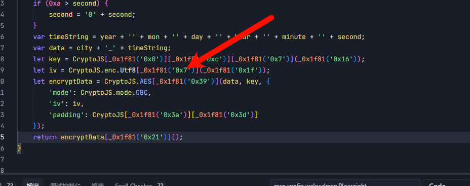

‍

‍

‍

‍

### 直接让AI帮我解析数据

把这个关键数据复制给AI，AI就能帮我解析出来数据，以后不用自己手搓了。

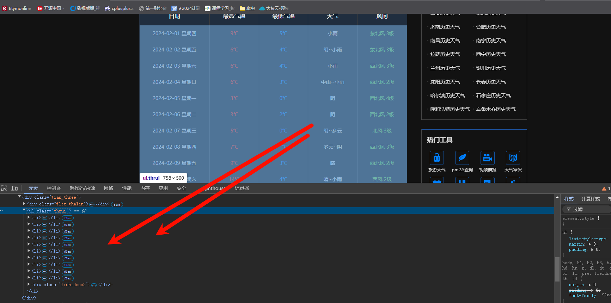

‍

‍

### 使用AI技巧

‍

存住数据，解析数据以及数据可视化都可以叫AI搞定了，一定要指定技术栈（pandas，pycharts，bueatifulsoup）。


‍

## 爬取流程

‍

### 分析抓包

‍

前面10行在这个包里面

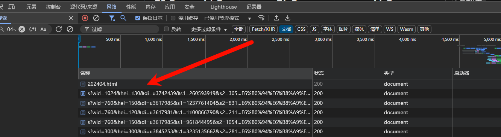=

‍

后面20行要点击这个“显示更多”才会显示出来

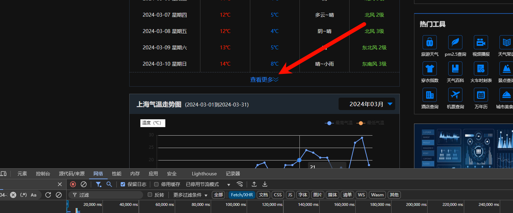

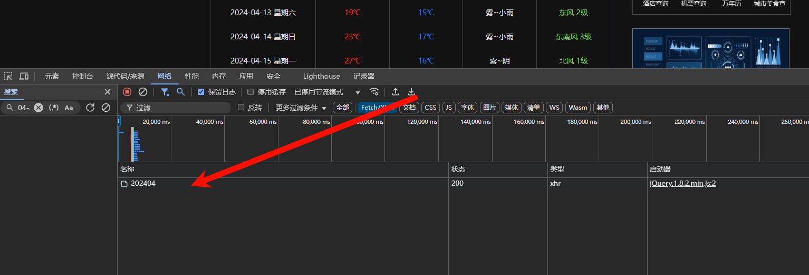

### 分析参数

钱10行，直接用beautifulsoup解析一下就行，重点是后面的。

‍

直接搜索参数，定位到这：

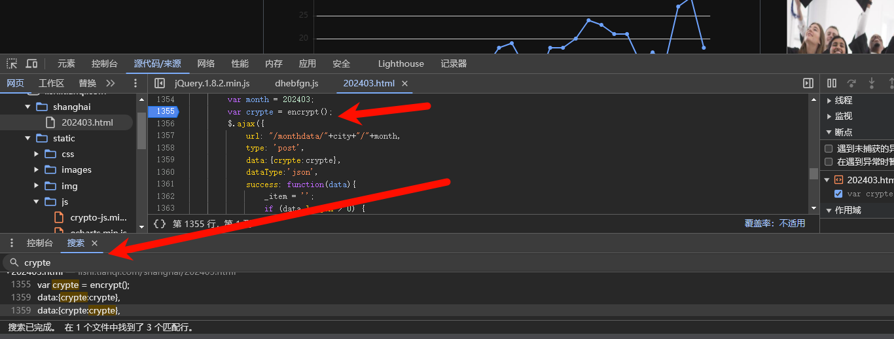

‍

‍

再回溯定位一下就定位到：

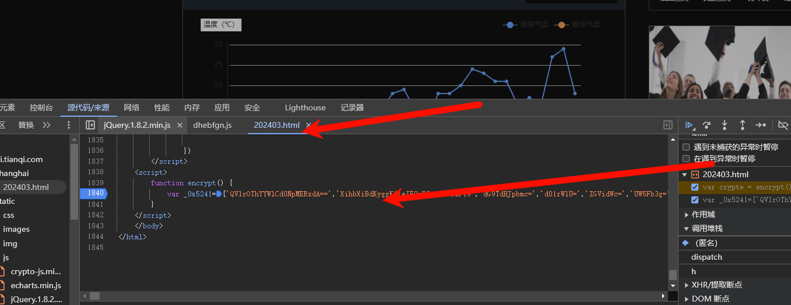

‍

整理一下就是下面的，我们把每一个函数都缩起来，看一下整体，其实他就是一个AES。前面是在定义变量。


‍

这里不好打断点，但是好在这里的函数不是很多，直接点几下下一次函数就好了

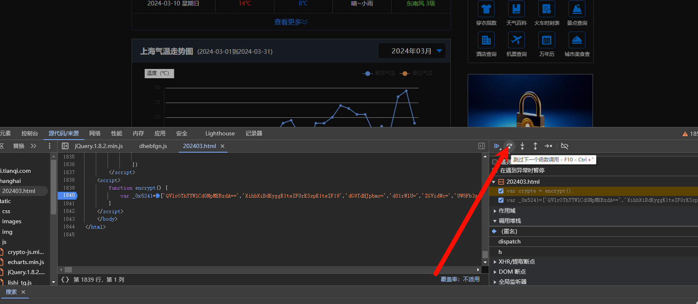

‍

定位到data，然后查看值，后面也是一样的，我们主要看的是：加密文本，iv，mode，padding，key。

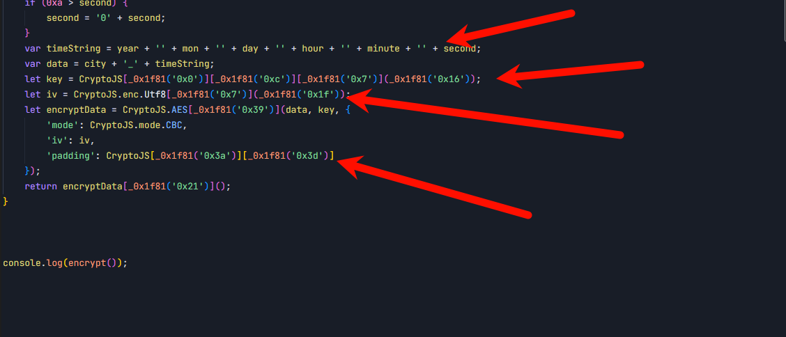

这里面的key和iv都是字节流，直接在控制台，用`CryptoJS.enc.Hex.stringify`解析一下就行，这个不会可以wenAI，让他说一下怎么在控制台里面转化这个数据。

一般只有data是变化的，其他都是固定的。所以其他的值确定一遍就行。

‍

‍

### 解析数据

后面20行：

把得到的数据复制前面几行给AI就行。

翻页爬取的时候要注意：

1. ​`Referer`要修改，这是他的前面的跳转链接，网站要检验的。
2. ​`response = requests.get('https://lishi.tianqi.com/shanghai/202403.html', headers=headers)`这个也要改，里面的含有时间这个变量
3. 以及每一次访问月份（包括重试）都要重新生成加密参数（因为网站会检验时间参数）。

‍

前面10行：

直接叫AI用解析一下就行，记得和后面20行要数据统一。

复制下面的元素给AI解析出来指定的字段就ok（要指定技术栈bueatifulsuop）。

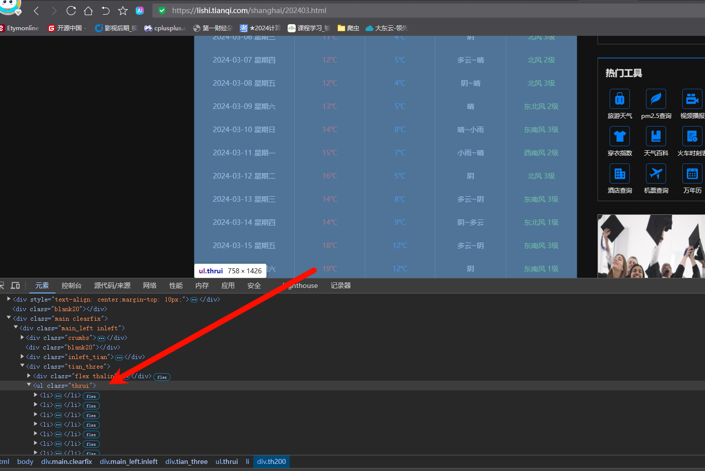

‍

‍

‍

### 存储数据

整合一下前10行和后面20行就行，数据格式要统一。

这个直接给AI做就ok，把数据描述清楚，一定要用pandas，这是效率最高的。

==一定要告诉他技术栈==


### 数据可视化

叫他用pycharts和存储的数据制作一个轮播图。

==一定要告诉他技术栈==

‍

‍

‍

## 全部代码

如果看不太清楚的话直接让AI解构一下就行。

‍

```python
'''Author: Python Crawler Developer crawler@example.com
Date: 2025-12-26 22:31:09
LastEditors: Python Crawler Developer crawler@example.com
LastEditTime: 2026-01-13 11:38:21
FilePath: \test\test.py
Description: AES CBC PKCS7加密实现，用于获取天气历史数据
'''

# 导入模块
import requests
import os
import json
import pandas as pd
from Crypto.Cipher import AES
from Crypto.Util.Padding import pad
import base64
from datetime import datetime
from bs4 import BeautifulSoup
# 可视化相关导入
from pyecharts.charts import Line, Timeline
from pyecharts import options as opts
from pyecharts.globals import ThemeType


# 配置常量
CITY = 'shanghai'
TARGET_YEAR = 2024

# 加密配置
KEY_HEX = '356861355a37635a33574e6244337241'
IV_HEX = '41596b39385861694277436930447374'

# 请求配置
COOKIES = {
    'UserId': '17681874983871313',
    'cityPy': CITY,
    'cityPy_expire': '1768792298',
    'Hm_lvt_ab6a683aa97a52202eab5b3a9042a8d2': '1768187499,1768216552',
    'HMACCOUNT': '60E7504DBCA5B956',
    'Hm_lpvt_ab6a683aa97a52202eab5b3a9042a8d2': '1768225819',
    'Hm_lvt_7c50c7060f1f743bccf8c150a646e90a': '1768225827',
    'Hm_lvt_30606b57e40fddacb2c26d2b789efbcb': '1768225838',
    'Hm_lpvt_30606b57e40fddacb2c26d2b789efbcb': '1768225838',
    'Hm_lpvt_7c50c7060f1f743bccf8c150a646e90a': '1768229472'
}

# API请求headers
API_HEADERS = {
    'accept': 'application/json, text/javascript, */*; q=0.01',
    'accept-language': 'zh-CN,zh;q=0.9',
    'content-type': 'application/x-www-form-urlencoded; charset=UTF-8',
    'origin': 'https://lishi.tianqi.com',
    'priority': 'u=1, i',
    'sec-ch-ua': '"Not A(Brand";v="8", "Chromium";v="132", "Google Chrome";v="132"',
    'sec-ch-ua-mobile': '?0',
    'sec-ch-ua-platform': '"Windows"',
    'sec-fetch-dest': 'empty',
    'sec-fetch-mode': 'cors',
    'sec-fetch-site': 'same-origin',
    'user-agent': 'Mozilla/5.0 (Windows NT 10.0; Win64; x64) AppleWebKit/537.36 (KHTML, like Gecko) Chrome/132.0.0.0 Safari/537.36',
    'x-requested-with': 'XMLHttpRequest'
}

# HTML抓取headers
HTML_HEADERS = {
    'Referer': f'https://lishi.tianqi.com/{CITY}/{TARGET_YEAR}01.html',
    'Upgrade-Insecure-Requests': '1',
    'User-Agent': 'Mozilla/5.0 (Windows NT 10.0; Win64; x64) AppleWebKit/537.36 (KHTML, like Gecko) Chrome/132.0.0.0 Safari/537.36',
    'sec-ch-ua': '"Not A(Brand";v="8", "Chromium";v="132", "Google Chrome";v="132"',
    'sec-ch-ua-mobile': '?0',
    'sec-ch-ua-platform': '"Windows"',
}


def aes_encrypt(text, key_hex, iv_hex):
    """
    AES CBC模式加密，PKCS7填充，Base64编码
    
    参数:
        text: str - 明文
        key_hex: str - 十六进制密钥
        iv_hex: str - 十六进制偏移
    
    返回:
        str - Base64编码的加密结果
    """
    # 转换密钥和偏移为字节
    key = bytes.fromhex(key_hex)
    iv = bytes.fromhex(iv_hex)
    
    # 创建AES加密器，CBC模式
    cipher = AES.new(key, AES.MODE_CBC, iv)
    
    # PKCS7填充
    padded_text = pad(text.encode('utf-8'), AES.block_size)
    
    # 加密并Base64编码
    encrypted_bytes = cipher.encrypt(padded_text)
    return base64.b64encode(encrypted_bytes).decode('utf-8')


def get_html_weather_data(year, month, rows=10):
    """
    从HTML页面获取指定月份的天气数据，默认获取前10行
    
    参数:
        year: int或str - 年份
        month: int或str - 月份
        rows: int - 要获取的行数，默认10
    
    返回:
        list - 天气数据列表
    """
    # 格式化月份为两位数
    month_str = f"{int(month):02d}"
    url = f'https://lishi.tianqi.com/{CITY}/{year}{month_str}.html'
    
    try:
        response = requests.get(url, headers=HTML_HEADERS, timeout=10)
        response.raise_for_status()
        
        # 使用BeautifulSoup解析HTML
        soup = BeautifulSoup(response.text, 'html.parser')
        
        # 找到天气数据所在的ul标签
        weather_ul = soup.find('ul', class_='thrui')
        
        if not weather_ul:
            print(f"未找到 {year}年{month}月的HTML天气数据")
            return []
        
        # 找到所有的天气数据li标签
        weather_items = weather_ul.find_all('li')
        
        print(f"找到 {year}年{month}月的 {len(weather_items)} 天的HTML天气数据")
        
        weather_data = []
        # 只取指定行数的数据
        for item in weather_items[:rows]:
            # 提取日期
            date_div = item.find('div', class_='th200')
            date = date_div.text.strip() if date_div else ""
            
            # 提取最高温度
            max_temp_div = item.find_all('div', class_='th140')[0] if item.find_all('div', class_='th140') else None
            max_temp = max_temp_div.text.strip().replace('°', '') if max_temp_div else ""
            
            # 提取最低温度
            min_temp_div = item.find_all('div', class_='th140')[1] if len(item.find_all('div', class_='th140')) > 1 else None
            min_temp = min_temp_div.text.strip().replace('°', '') if min_temp_div else ""
            
            # 提取天气状况
            weather_div = item.find_all('div', class_='th140')[2] if len(item.find_all('div', class_='th140')) > 2 else None
            weather = weather_div.text.strip() if weather_div else ""
            
            # 提取风向风力
            wind_div = item.find_all('div', class_='th140')[3] if len(item.find_all('div', class_='th140')) > 3 else None
            wind = wind_div.text.strip() if wind_div else ""
            
            # 格式化数据为统一格式
            weather_data.append({
                'date_str': date,
                'htemp': max_temp,
                'ltemp': min_temp,
                'weather': weather,
                'wind': wind
            })
        
        print(f"成功获取 {year}年{month}月前{len(weather_data)}行HTML数据")
        return weather_data
    except Exception as e:
        print(f"获取 {year}年{month}月HTML数据时出错: {e}")
        return []


def generate_urls(year, month, city=CITY):
    """
    生成天气历史数据请求的URL
    
    参数:
        year: int或str - 年份，如2025
        month: int或str - 月份，如3或03
        city: str - 城市拼音
    
    返回:
        dict - 包含referer和post_url的字典
    """
    # 格式化年份和月份为yyyymm格式
    year_month = f"{year}{int(month):02d}"
    
    # 生成URLs
    return {
        'referer': f"https://lishi.tianqi.com/{city}/{year_month}.html",
        'post_url': f"https://lishi.tianqi.com/monthdata/{city}/{year_month}"
    }


def get_monthly_weather_data(year, month, encrypted_value, rows=20):
    """
    从API获取指定月份的天气数据，默认获取后20行
    
    参数:
        year: int或str - 年份
        month: int或str - 月份
        encrypted_value: str - 加密值
        rows: int - 要获取的行数，默认20
    
    返回:
        list - 天气数据列表
    """
    # 生成URL
    urls = generate_urls(year, month)
    print(f"Referer: {urls['referer']}")
    print(f"Post URL: {urls['post_url']}")
    
    # 更新headers中的referer
    headers = API_HEADERS.copy()
    headers['referer'] = urls['referer']
    
    # 请求数据，最多重试3次
    max_retries = 3
    for retry in range(max_retries):
        try:
            # 每次请求（包括重试）都生成新的加密值
            current_time = datetime.now().strftime('%Y%m%d%H%M%S')
            plaintext = f'{CITY}_{current_time}'
            current_encrypted_value = aes_encrypt(plaintext, KEY_HEX, IV_HEX)
            
            data = {'crypte': current_encrypted_value}
            print(f"第 {retry+1}/{max_retries} 次请求，发送的数据: {data}")
            
            response = requests.post(urls['post_url'], cookies=COOKIES, headers=headers, data=data, timeout=10)
            print(f"请求状态码: {response.status_code}")
            
            # 检查状态码
            if response.status_code == 200:
                # 解析响应
                month_data = response.json()
                print(f"解析成功，共 {len(month_data)} 条数据")
                
                # 只返回后rows行数据
                if month_data:
                    # 处理数据格式，确保与HTML数据格式一致
                    formatted_data = []
                    for item in month_data:
                        # 合并风向和风力为"风向 风力"格式
                        wind = item['WD'] + ' ' + item['WS'] if item.get('WD') and item.get('WS') else ''
                        formatted_data.append({
                            'date_str': item['date_str'],
                            'htemp': item['htemp'],
                            'ltemp': item['ltemp'],
                            'weather': item['weather'],
                            'wind': wind
                        })
                    
                    # 只取后rows行数据
                    result = formatted_data[-rows:]
                    print(f"返回 {year}年{month}月后{len(result)}行API数据")
                    return result
                return []
            elif response.status_code == 504:
                print(f"网关超时，第 {retry+1}/{max_retries} 次重试...")
                import time
                time.sleep(3)  # 延长重试间隔
            else:
                print(f"请求失败，状态码: {response.status_code}")
                break
        except requests.exceptions.Timeout:
            print(f"请求超时，第 {retry+1}/{max_retries} 次重试...")
            import time
            time.sleep(3)
        except json.JSONDecodeError:
            print(f"JSON解析失败，响应内容: {response.text}")
            break
        except Exception as e:
            print(f"处理数据时出错: {e}")
            break
    
    return []


def get_yearly_weather_data(year):
    """
    获取指定年份的全年天气数据，每个月合并HTML前10行和API后20行数据
    
    参数:
        year: int或str - 年份
    
    返回:
        list - 全年天气数据列表
    """
    all_weather_data = []
    
    # 遍历12个月
    for month in range(1, 13):
        print(f"\n===== 获取 {year} 年 {month} 月数据 =====")
        
        # 1. 获取HTML前10行数据
        html_data = get_html_weather_data(year, month, rows=10)
        
        # 2. 获取API后20行数据
        # 为每个月份重新生成加密值，确保时间戳最新
        current_time = datetime.now().strftime('%Y%m%d%H%M%S')
        plaintext = f'{CITY}_{current_time}'
        encrypted_value = aes_encrypt(plaintext, KEY_HEX, IV_HEX)
        print(f"月份 {month} 加密值: {encrypted_value}")
        
        api_data = get_monthly_weather_data(year, month, encrypted_value, rows=20)
        
        # 3. 合并数据，确保没有重复
        combined_data = []
        
        # 添加HTML数据
        if html_data:
            combined_data.extend(html_data)
            print(f"添加了 {len(html_data)} 行HTML数据")
        
        # 添加API数据，跳过与HTML数据重复的日期
        if api_data:
            html_dates = {item['date_str'] for item in html_data}
            new_api_data = [item for item in api_data if item['date_str'] not in html_dates]
            combined_data.extend(new_api_data)
            print(f"添加了 {len(new_api_data)} 行新的API数据")
        
        # 4. 添加到全年数据
        if combined_data:
            all_weather_data.extend(combined_data)
            print(f"{year}年{month}月共合并 {len(combined_data)} 行数据")
        
        # 添加请求间隔，避免触发网站限流
        import time
        time.sleep(3)  # 3秒延迟
    
    return all_weather_data


def save_weather_data_to_csv(data, year):
    """
    将天气数据保存为CSV文件，并处理空值
    
    参数:
        data: list - 天气数据列表
        year: int或str - 年份
    """
    if not data:
        print(f"\n未获取到 {year} 年的任何数据")
        return
    
    print(f"\n===== 全年数据处理 =====")
    print(f"总共获取到 {len(data)} 条数据")
    
    # 转换为DataFrame
    df = pd.DataFrame(data)
    
    # 数据已经是统一格式，直接使用
    # 保留需要的字段：日期，最高气温，最低气温，天气，风向风力
    required_columns = ['date_str', 'htemp', 'ltemp', 'weather', 'wind']
    df = df[required_columns]
    
    # 统一日期格式：移除星期信息
    def clean_date(date_str):
        if isinstance(date_str, str):
            # 分割日期和星期，只保留日期部分（如"2024-01-01 星期一" → "2024-01-01"）
            return date_str.split(' ')[0]
        return date_str
    
    df['date_str'] = df['date_str'].apply(clean_date)
    
    # 处理温度数据：移除℃符号并转换为数值类型
    def clean_temp(temp_str):
        if isinstance(temp_str, str):
            return temp_str.replace('℃', '')
        return temp_str
    
    df['htemp'] = df['htemp'].apply(clean_temp)
    df['ltemp'] = df['ltemp'].apply(clean_temp)
    
    # 转换温度列为数值类型
    df['htemp'] = pd.to_numeric(df['htemp'], errors='coerce')
    df['ltemp'] = pd.to_numeric(df['ltemp'], errors='coerce')
    
    # 数据清洗：处理空值
    print("\n数据清洗前 - 空值统计:")
    print(df.isnull().sum())
    
    # 1. 移除完全为空的数据行
    df = df.dropna(how='all')
    
    # 2. 填充数值型空值为0
    numeric_columns = df.select_dtypes(include=['int64', 'float64']).columns
    df[numeric_columns] = df[numeric_columns].fillna(0)
    
    # 3. 填充字符串型空值为空字符串
    string_columns = df.select_dtypes(include=['object']).columns
    df[string_columns] = df[string_columns].fillna('')
    
    print(f"\n数据清洗后 - 剩余 {len(df)} 条数据")
    print("空值统计:")
    print(df.isnull().sum())
    
    # 数据预览
    print("\n数据预览:")
    print(df.head())
    
    # 保存为CSV
    csv_filename = f"weather_data_{year}.csv"
    df.to_csv(csv_filename, index=False, encoding='utf-8-sig')
    
    print(f"\n全年数据已保存为: {csv_filename}")
    print(f"文件路径: {os.path.abspath(csv_filename)}")


def create_weather_carousel(year):
    """
    创建天气数据轮播图
    
    参数:
        year: int或str - 年份
    
    返回:
        str - 生成的HTML文件名
    """
    # 读取CSV数据
    csv_filename = f"weather_data_{year}.csv"
    if not os.path.exists(csv_filename):
        print(f"未找到 {csv_filename} 文件，无法生成轮播图")
        return None
    
    df = pd.read_csv(csv_filename)
    
    # 数据处理：提取月份和日期信息（日期已经统一格式）
    df['date_str'] = pd.to_datetime(df['date_str'])
    df['month'] = df['date_str'].dt.month
    df['day'] = df['date_str'].dt.day
    
    # 创建时间线（轮播图）
    timeline = Timeline(
        init_opts=opts.InitOpts(
            theme=ThemeType.LIGHT,
            width="1200px",
            height="600px",
            page_title=f"{year}年天气数据轮播图"
        )
    )
    
    # 设置时间线自动播放
    timeline.add_schema(
        play_interval=2000,  # 播放间隔，毫秒
        is_auto_play=True,   # 自动播放
        is_loop_play=True,   # 循环播放
        is_timeline_show=True,  # 显示时间线
        orient="horizontal",  # 水平方向
        pos_left="center",   # 居中显示
        label_opts=opts.LabelOpts(
            formatter="{b}月",  # 月份显示格式
            color="#333"
        )
    )
    
    # 按月份分组生成折线图
    for month in range(1, 13):
        # 筛选当月数据
        month_data = df[df['month'] == month]
        
        # 创建折线图
        line = Line()
        
        # 添加数据
        line.add_xaxis(month_data['day'].tolist())  # 日期作为X轴
        
        # 最高气温折线
        line.add_yaxis(
            series_name="最高气温(°C)",
            y_axis=month_data['htemp'].tolist(),
            symbol="circle",
            symbol_size=6,
            label_opts=opts.LabelOpts(is_show=False),
            itemstyle_opts=opts.ItemStyleOpts(color="#ff6b6b")
        )
        
        # 最低气温折线
        line.add_yaxis(
            series_name="最低气温(°C)",
            y_axis=month_data['ltemp'].tolist(),
            symbol="circle",
            symbol_size=6,
            label_opts=opts.LabelOpts(is_show=False),
            itemstyle_opts=opts.ItemStyleOpts(color="#4ecdc4")
        )
        
        # 设置图表标题
        line.set_global_opts(
            title_opts=opts.TitleOpts(
                title=f"{year}年{month}月{CITY}天气气温变化",
                subtitle="数据来源：天气历史数据",
                title_textstyle_opts=opts.TextStyleOpts(
                    font_size=18,
                    color="#333"
                )
            ),
            tooltip_opts=opts.TooltipOpts(
                trigger="axis",
                axis_pointer_type="cross",
                formatter="{b}日<br/>{a}: {c}°C"
            ),
            xaxis_opts=opts.AxisOpts(
                name="日期",
                name_location="middle",
                name_gap=30,
                axislabel_opts=opts.LabelOpts(
                    formatter="{value}日"
                )
            ),
            yaxis_opts=opts.AxisOpts(
                name="气温(°C)",
                name_location="middle",
                name_gap=40,
                min_="dataMin - 2",
                max_="dataMax + 2"
            ),
            legend_opts=opts.LegendOpts(
                pos_top="10%",
                textstyle_opts=opts.TextStyleOpts(
                    font_size=14
                )
            )
        )
        
        # 设置系列样式
        line.set_series_opts(
            line_style_opts=opts.LineStyleOpts(width=3)
        )
        
        # 将折线图添加到时间线
        timeline.add(line, f"{month}")
    
    # 生成HTML文件
    output_filename = f"weather_carousel_{year}.html"
    timeline.render(output_filename)
    print(f"天气数据轮播图已生成：{output_filename}")
    
    return output_filename


def create_weather_summary(year):
    """
    创建天气数据汇总图表
    
    参数:
        year: int或str - 年份
    
    返回:
        str - 生成的HTML文件名
    """
    # 读取CSV数据
    csv_filename = f"weather_data_{year}.csv"
    if not os.path.exists(csv_filename):
        print(f"未找到 {csv_filename} 文件，无法生成汇总图表")
        return None
    
    df = pd.read_csv(csv_filename)
    
    # 数据处理：提取日期部分，处理带星期的日期格式
    df['date_only'] = df['date_str'].str.split(' ', expand=True)[0]
    
    # 数据处理：按月统计
    monthly_stats = df.groupby(pd.to_datetime(df['date_only']).dt.month).agg({
        'htemp': ['max', 'mean'],
        'ltemp': ['min', 'mean']
    }).reset_index()
    
    monthly_stats.columns = ['month', 'max_htemp', 'avg_htemp', 'min_ltemp', 'avg_ltemp']
    
    # 创建折线图
    line = Line(
        init_opts=opts.InitOpts(
            theme=ThemeType.LIGHT,
            width="1200px",
            height="600px",
            page_title=f"{year}年天气数据汇总"
        )
    )
    
    # 添加数据
    line.add_xaxis([f"{i}月" for i in range(1, 13)])
    
    line.add_yaxis(
        series_name="最高气温(°C)",
        y_axis=monthly_stats['max_htemp'].tolist(),
        symbol="diamond",
        symbol_size=8,
        itemstyle_opts=opts.ItemStyleOpts(color="#ff6b6b")
    )
    
    line.add_yaxis(
        series_name="平均气温(°C)",
        y_axis=[round(x, 1) for x in monthly_stats['avg_htemp'].tolist()],
        symbol="circle",
        symbol_size=8,
        itemstyle_opts=opts.ItemStyleOpts(color="#4ecdc4")
    )
    
    line.add_yaxis(
        series_name="最低气温(°C)",
        y_axis=monthly_stats['min_ltemp'].tolist(),
        symbol="triangle",
        symbol_size=8,
        itemstyle_opts=opts.ItemStyleOpts(color="#95e1d3")
    )
    
    # 设置图表选项
    line.set_global_opts(
        title_opts=opts.TitleOpts(
            title=f"{year}年{CITY}月度气温变化汇总",
            subtitle="数据来源：天气历史数据",
            title_textstyle_opts=opts.TextStyleOpts(
                font_size=18,
                color="#333"
            )
        ),
        tooltip_opts=opts.TooltipOpts(
            trigger="axis",
            axis_pointer_type="cross"
        ),
        xaxis_opts=opts.AxisOpts(
            name="月份",
            name_location="middle",
            name_gap=30
        ),
        yaxis_opts=opts.AxisOpts(
            name="气温(°C)",
            name_location="middle",
            name_gap=40
        ),
        legend_opts=opts.LegendOpts(
            pos_top="10%"
        )
    )
    
    # 设置系列样式
    line.set_series_opts(
        line_style_opts=opts.LineStyleOpts(width=3)
    )
    
    # 生成HTML文件
    output_filename = f"weather_summary_{year}.html"
    line.render(output_filename)
    print(f"天气数据汇总图表已生成：{output_filename}")
    
    return output_filename


def main():
    """
    主函数，执行完整的数据爬取到可视化流程
    """
    print(f"开始获取 {TARGET_YEAR} 年 {CITY} 天气数据...")
    # 获取全年数据，每个月份会自动生成新的加密值
    yearly_data = get_yearly_weather_data(TARGET_YEAR)
    
    # 保存数据
    save_weather_data_to_csv(yearly_data, TARGET_YEAR)
    
    # 生成可视化图表
    print(f"\n开始生成 {TARGET_YEAR} 年天气数据可视化图表...")
    create_weather_carousel(TARGET_YEAR)
    create_weather_summary(TARGET_YEAR)
    print("所有图表生成完成！")
    
    print(f"\n===== 完整流程执行完毕 =====")
    print(f"1. 已获取 {TARGET_YEAR} 年 {CITY} 天气数据")
    print(f"2. 数据已保存到 weather_data_{TARGET_YEAR}.csv")
    print(f"3. 已生成天气数据轮播图和汇总图表")


if __name__ == "__main__":
    main()

```

##
