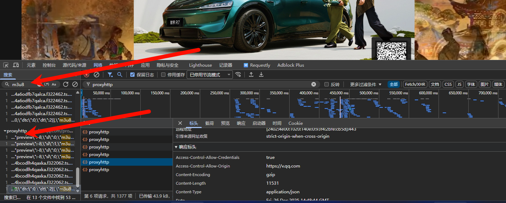
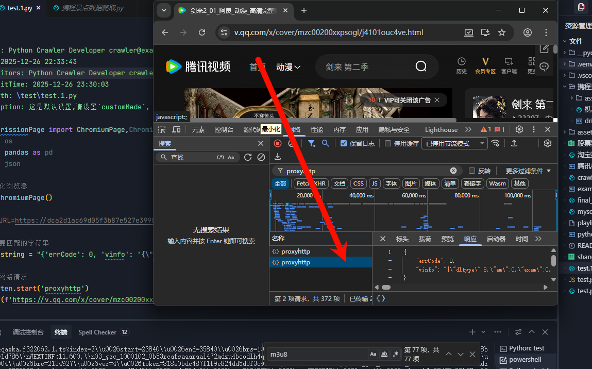

# 腾讯视频（能看到的）爬取

直接搜索m3u8就能找到这个包（我一个一个试的，有很多看一眼就不是的，这个才是的）。

找到这个包之后发现他有5个这样的包，我只要监听到地个停止就好了。

可以用这个设置循环监听，当数据包的前面几个字符是：““{'errCode': 0, 'vinfo': '{"dltype":8,"em":0,"exem":0,"fl":{””这个就停止监听，然后就可以处理对应的数据了。

我发现有俩个这样的包，一个是（底下）小视频，一个是目标视频，只要提取出俩个就行了。

不一定是5个，要一个一个调试才知道。

- 如果说有一些资源是需要清除缓存的话，可以直接用无痕模式就好了。

## 小日记

好家伙，腾讯你赢了，我还是搞不定，搞了一天了。

先去学，再来搞吧，不然真的很难受。

不过我也学到了如何从腾讯那里拿到m3u8链接了，那就是找`proxyhttp`这个包，里面的最后一个m3u8链接（这个猫抓都识别不到），以后如果说有机会再来弄。

怎么找到这个包呢，直接在筛选里面筛选也可以，或者直接搜索m3u8一个一个排除就行。

